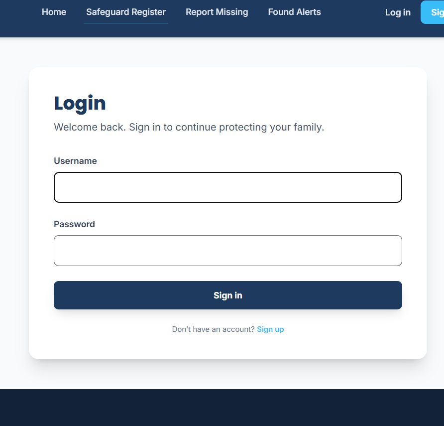
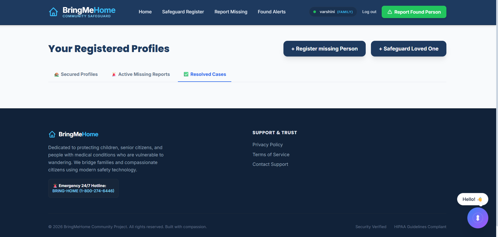
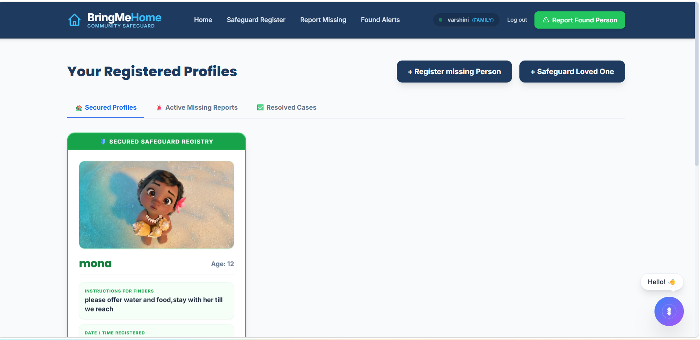
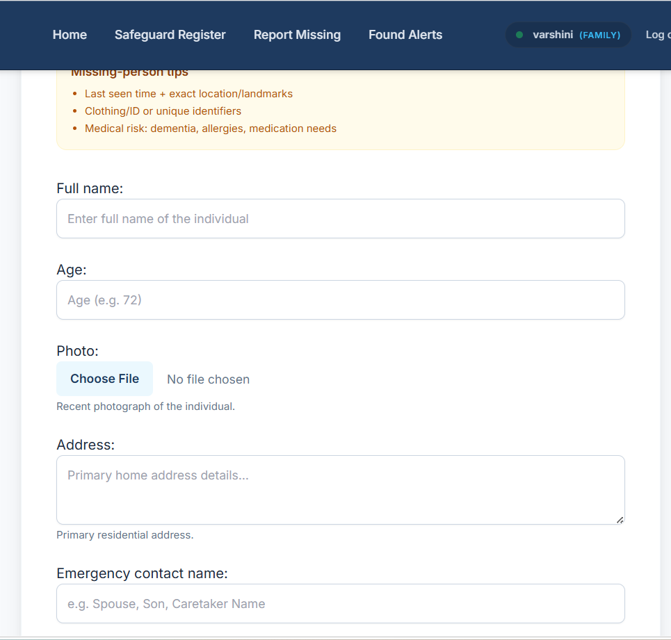

🏠 BringMeHome – AI-Powered Missing Person Registry & Sighting Tracker

Using AI and community collaboration to help reunite missing individuals with their families.

🌟 Why I Built This Project

Every year, thousands of children, senior citizens, dementia patients, and vulnerable individuals go missing, leaving families searching with limited resources and fragmented information.

I built BringMeHome to explore how Artificial Intelligence can be used for social good by connecting missing-person registries with real-time community sighting reports. The goal is to reduce search time, improve identification accuracy, and help families reunite with their loved ones faster.

📌 Project Overview

BringMeHome is an AI-powered web platform built using Python, Django, and Gemini AI that enables:

✅ Family members to register vulnerable individuals

✅ Citizens to report found sightings

✅ AI-powered image matching between registered profiles and public reports

✅ Real-time confidence scoring and match explanations

✅ Centralized tracking of missing and found cases

The platform creates an intelligent bridge between communities and families, making search efforts faster and more effective.

🛡️ Safeguard Registry

The Safeguard Registry serves as the secure foundation of the platform, storing profiles of individuals who may require protection and monitoring.

Key Features

👤 Vulnerable Individual Profiles

Full Name
Address
Age
Medical / Dementia Notes
Emergency Information
Reference Photograph

📍 Status Tracking

Active
Missing
Found

🏷️ Category-Based Organization

Senior Citizens
Children & Minors
Dementia Patients
Medical & Cognitive Vulnerabilities
📢 Citizen Sighting Portal

The community plays a critical role in the search process.

Citizens can submit sightings through a dedicated portal by providing:

📸 Recent photographs

📍 Location information

📝 Descriptive notes

🙈 Anonymous or authenticated submissions

This allows real-world observations to immediately enter the matching pipeline.

🤖 AI Match Center

The heart of BringMeHome is the AI-powered matching system.

Features

🔍 Automated profile-to-sighting comparison

📊 AI-generated confidence scores

🧠 Visual reasoning generated by Gemini AI

⚡ Real-time match evaluation

✅ Administrator verification workflow

🔄 Automatic status updates for verified matches

⚙️ AI Matching Pipeline
1️⃣ Profile & Report Retrieval

The system retrieves:

Active registry profiles
Missing person records
Recent sighting reports
2️⃣ Image Processing

Images are:

Validated
Converted to byte streams
Prepared for AI inference
3️⃣ Gemini Vision Analysis

Using:

Google GenAI SDK
Gemini 2.5 Flash

The AI analyzes visual similarities between registered individuals and newly reported sightings.

4️⃣ Confidence Generation

The system generates:

📈 Similarity Percentage

🧠 Match Explanation

🎯 Confidence Score

5️⃣ Smart Fallback System

If the AI service becomes unavailable, the application automatically switches to a text-based heuristic matching engine that compares:

Names
Addresses
Locations
Descriptive attributes

ensuring uninterrupted functionality.

🛠️ Tech Stack
Backend

🐍 Python

🌐 Django

Frontend

🎨 HTML5

🎨 CSS3

⚡ JavaScript

💨 Tailwind CSS

🧩 Django Templates

AI Integration

🤖 Google GenAI SDK

🧠 Gemini 2.5 Flash

Database

🗄️ SQLite

Environment Management

🔐 Python Dotenv

📂 Project Structure
BringMeHome/
│
├── registry/
├── templates/
├── static/
├── media/
├── .env.example
├── db.sqlite3
├── manage.py
└── requirements.txt
📷 Screenshots
🔐 Login Portal

📷 Screenshots

📝 signup and login 

📝 Home page

📝 dashboard 

📝 Vulnerable Individual Registration

📢 Report Found Sighting
)

📝 safegaurd registration

🤖 AI Match Dashboard

(Add Screenshot)

🚀 Future Enhancements
📲 Emergency Alert System
SMS Notifications
WhatsApp Broadcasts
Community Safety Alerts
🗺️ Geospatial Tracking
Live Map Integration
Historical Sighting Visualization
Geofencing Support
🏛️ Authority Integrations
Police Department Notifications
Municipal Safety Systems
Verified Alert Escalation
📱 Mobile Application
Android App
iOS App
Push Notifications
📈 Development Log
Version 1.0

✅ User Authentication

✅ Safeguard Registry

✅ Missing Person Registration

✅ Citizen Sighting Reports

✅ Gemini AI Integration

✅ AI Confidence Scoring

✅ Match Dashboard

✅ Fallback Matching Engine

📝 Daily Updates
2026-06-26
Added Gemini Vision matching pipeline
Implemented AI confidence scoring
Improved image handling process
2026-06-27
Added dashboard improvements
Enhanced report validation
Fixed matching workflow bugs
2026-06-28
Added geolocation groundwork
Improved registration forms
Optimized AI response handling
❤️ Social Impact

BringMeHome is more than a technical project.

It represents how Artificial Intelligence can be applied to solve real-world social challenges, helping communities, families, and authorities collaborate to locate vulnerable individuals and bring them home safely.
